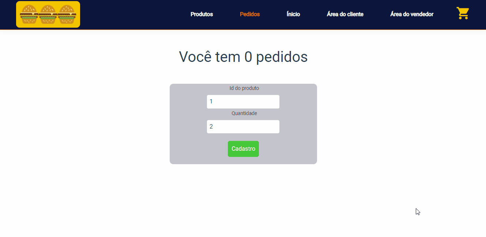
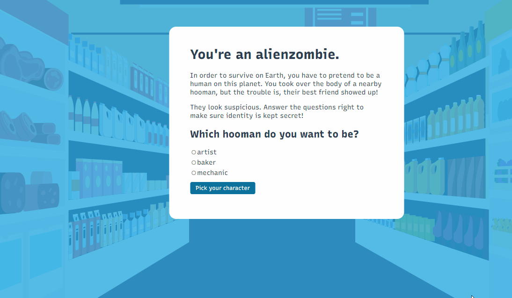

# 
Vue.js-My-Projects

 

## 🔍 About

This is a repository with some of my projects on VUE I hope you enjoy and fell free to use if you want!

 

## 🚀 The Projects

 

### 💻 NUXT FOOD APP. <a href="https://github.com/gustavobacellarladeira/Vue.js-My-Projects/tree/main/Vue.js-Nuxt.js--Food-%20App">Go to the project !</a>

 
 

 
 

 
 

### 💻 Interligado <a href="https://github.com/gustavobacellarladeira/Vue.js-My-Projects/tree/main/Interligado">Go to the project !</a>

 
 

 
 

 
 

### ☕ Challenger ZETTA. Made with vue.js(frontEnd) and node.js(backEnd) and MongoDB(database). <a href="https://github.com/gustavobacellarladeira/Vue.js-My-Projects/tree/main/Desafio-daZeta">Go to the project !</a>

 
 

 
 

 
 

### 👽 Alien game made with vue.js. <a href="https://github.com/gustavobacellarladeira/Vue.js-My-Projects/tree/main/Vue.js-Alien-Game-basicsOfVue.js">Go to the project !</a>

[🚀 Netlify ](https://aliengame-vue.netlify.app/)
 
 

 
 

 
 

## ✨ Technologies used on this projects

 

<ul>
    <li> Vue.js
    <li> Nuxt.js
    <li> Html / Css
    <li> Rest apis
    <li> Java
    <li> Spring Boot
    <li> Node.js
    <li> MongoDb

</ul>

 

 

 
Made with ♥ by Gustavo Bacellar 👋 <a href="https://www.linkedin.com/in/gustavo-bacellar/?msgControlName=reply_to_sender&msgConversationId=6714883939833561088&msgOverlay=true">Get in touch!</a>
